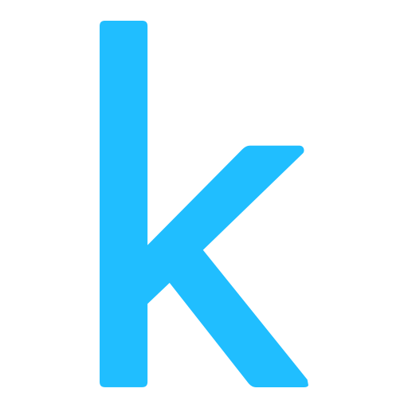

<!--     Header -->

<!--     Intro -->
<h1>Ali Mohamed</h1>

<strong>Odoo Developer | AI Engineer | Data Scientist</strong>

Welcome to my GitHub profile! I'm a versatile developer working at the intersection of
<strong>ERP systems</strong> and <strong>Artificial Intelligence</strong>. On one side, I build and customize
<strong>Odoo</strong> modules and business solutions (Sales, Inventory, Accounting, POS, Website) to automate
and streamline company workflows. On the other side, I design and deploy <strong>Machine Learning, NLP,
and Computer Vision</strong> models using techniques like prompt engineering, GANs, and LLMs such as BERT
and GPT-2. I enjoy combining both worlds — bringing AI-powered features into ERP systems and building
data-driven solutions that create real business impact.

<!--     Skills -->
<h2>🧩 Odoo Development</h2>

<strong>Languages:</strong> Python, XML, PostgreSQL

<strong>Core Skills:</strong> Odoo ORM, Custom Module Development, Odoo Apps Customization (Sales, Inventory, Accounting, POS, Website), Views & Workflows, QWeb Reports

<strong>Tools:</strong> Git, Linux Server Deployment

<h2>🤖 AI / Machine Learning / Data Science</h2>

<strong>Frameworks / Packages:</strong> TensorFlow, PyTorch, Hugging Face Transformers, OpenCV, Scikit-Learn

<strong>Concepts:</strong> Machine Learning, Deep Learning, Natural Language Processing (NLP), Computer Vision (CV), Generative AI, Prompt Engineering, GANs, LLMs (BERT, GPT-2)

<strong>Data Analysis:</strong> Pandas, NumPy, Matplotlib, Seaborn, Plotly, Power BI, Streamlit

<h2>💻 General Programming</h2>

<strong>Languages:</strong> Python, C++, MySQL, HTML, Markdown

<strong>Concepts:</strong> Object-Oriented Programming (OOP), Data Structures, Algorithms

<h2>🛠️ Platforms / Tools</h2>

<strong>Operating Systems / SaaS / PM Tools:</strong> Linux, Kaggle Kernels, Google Colab, GitHub, Trello, Microsoft Project

<!--     Projects -->

<!--     Stats -->
 
 
 

<!--     Links -->
<h1>Contact Me</h1>

<!--     Footer -->

